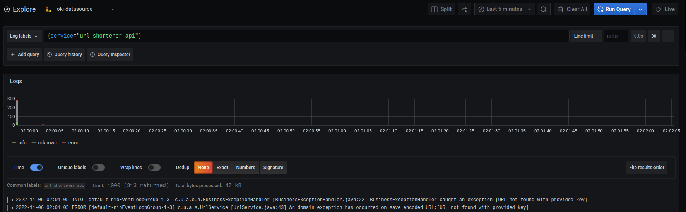
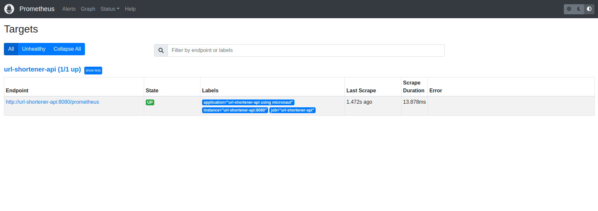
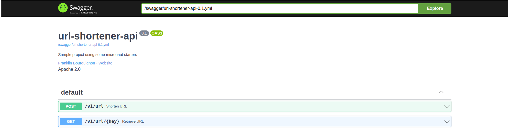

# url-shortener
Simple proof of concept using some micronaut starters and Observability tools.

- [x] [Micronaut 3.7.2](https://micronaut.io/)
- [x] [Micronaut Data MongoDB](https://micronaut-projects.github.io/micronaut-data/latest/guide/#mongo)
- [x] [Micronaut Test Resources](https://micronaut-projects.github.io/micronaut-test-resources/latest/guide/)
- [x] [Micronaut Micrometer](https://micronaut-projects.github.io/micronaut-micrometer/latest/guide/)
- [x] [Grafana](https://grafana.com/)
- [x] [Prometheus](https://prometheus.io/)
- [x] [Loki](https://grafana.com/oss/loki/)
- [x] [Promptail](https://grafana.com/docs/loki/latest/clients/promtail/)
- [x] Java 11
- [x] Docker


## Grafana
Grafana is running on port 3000

[Sample Query](http://localhost:3000/explore?orgId=1&left=%5B%22now-5m%22,%22now%22,%22loki-datasource%22,%7B%22expr%22:%22%7Bservice%3D%5C%22url-shortener-api%5C%22%7D%22%7D%5D)



## Prometheus
Prometheus is running on port 9090

[Sample Query](http://localhost:9090/graph?g0.expr=rate(http_server_requests_seconds_count%5B5m%5D)&g0.tab=0&g0.stacked=0&g0.show_exemplars=0&g0.range_input=1h)



## Swagger UI
[swagger-ui url](http://localhost:8080/swagger-ui#/)



## Running the project
This command starts all containers and builds the project.
```console
url-shortener % make start
```